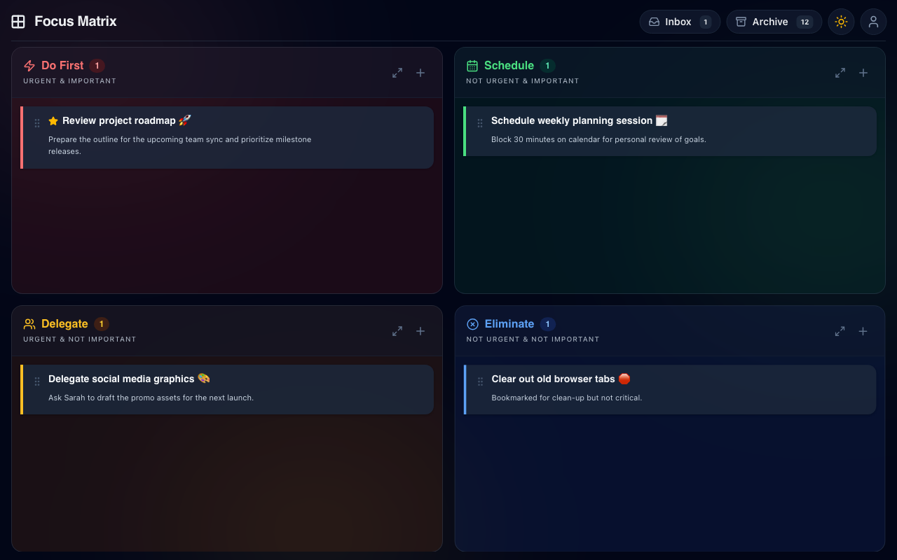
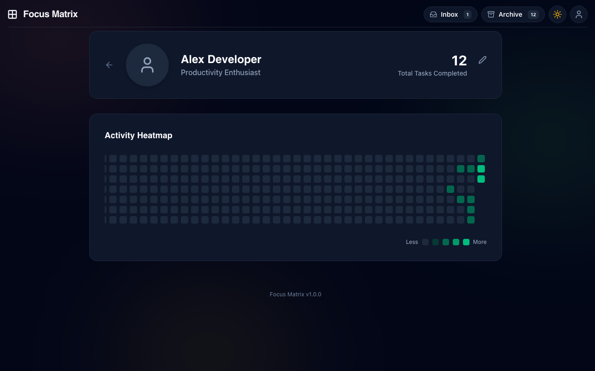

# ⚡ Focus Matrix

[](https://react.dev/)
[](https://www.typescriptlang.org/)
[](https://vite.dev/)
[](https://tailwindcss.com/)
[](https://hono.dev/)
[](https://orm.drizzle.team/)
[](https://opensource.org/licenses/MIT)

Focus Matrix is a highly polished, interactive productivity web application designed to help you prioritize tasks using the **Eisenhower Matrix** method. Beautifully crafted with modern aesthetics, clean typography, smooth layout animations, and dark/light themes, it is the ultimate tool for visual task management.

It is **local-first**: it works fully offline in guest mode (browser storage), and optionally syncs to a **portable self-hosted backend** (Hono + Drizzle + SQLite) that runs unmodified on **Cloudflare Workers/Pages (D1)**, a **VPS via Docker**, or plain **Node.js** — zero vendor lock-in.

---

## 📸 Screenshots

### 🖥️ Main Dashboard (Dark Mode)


### 📊 Productivity Analytics & Activity Heatmap


---

## ✨ Features

- **🌀 The 4-Quadrant Matrix:** Classify your tasks into *Do First* (Urgent & Important), *Schedule* (Important, Not Urgent), *Delegate* (Urgent, Not Important), and *Eliminate* (Neither).
- **🎛️ Drag and Drop Sorting:** Drag tasks seamlessly between quadrants and the Inbox. Powered by `@dnd-kit` with layout animation feedback.
- **📥 Global Inbox:** Capture tasks immediately without interrupting your flow. A dedicated side-panel keeps raw ideas until you are ready to categorize them.
- **📈 Productivity Heatmap:** Track your progress over time with a GitHub-style 52-week activity heatmap. Clicking on any day reveals the exact list of tasks completed on that date.
- **⭐ Starred Tasks (Sub-Prioritization):** Pin your most critical task tickets to the top of each quadrant for immediate focus.
- **🧘 Zen Mode:** Maximize a single quadrant to focus exclusively on one category of tasks.
- **🗄️ Completed Task Archive:** Keep your board clean. Move completed tasks into a date-sorted archive with full restore capabilities.
- **🌓 Adaptive Dark Theme:** Automatic system-based theme matching with manual toggle, styled with smooth transitions.
- **📱 Fully Responsive Design:** Fluid layout adapting seamlessly to ultra-wide desktops, tablets, and mobile drawers.

### 🔐 Accounts & Sync (optional, self-hosted)

- **Email & Password Auth:** Register and log in with secure, portable PBKDF2 password hashing (WebCrypto — no native dependencies) and 30-day HTTP-only session cookies.
- **Guest Mode with One-Time Migration:** Use the app with no account at all — everything lives in `localStorage`. When you sign up or log in, your local tasks are merged into your server account automatically.
- **Cross-Device Sync:** Tasks, quadrant placement, starring, archive state, and profile data sync through the backend so your matrix follows you across devices.
- **Offline Resilience:** Authenticated changes are mirrored to a local cache, so the board keeps working when the connection drops.
- **JSON Backup Export/Import:** Download your entire task list as a JSON file from the Profile page (or import one) — your data is never locked in.
- **Registration Kill-Switch:** Close signups with a single environment variable while existing users keep logging in.

---

## 🧠 Eisenhower Matrix Methodology

The matrix organizes tasks into four quadrants based on their **urgency** and **importance**:

| Urgent & Important | Not Urgent but Important |
| :--- | :--- |
| **Q1: Do First**<br>Tasks that require immediate attention and directly affect goals. | **Q2: Schedule**<br>Tasks that help achieve goals but can be planned for later. |
| **Q3: Delegate**<br>Tasks that must be done soon but can be assigned to others. | **Q4: Eliminate**<br>Distractions or low-value tasks that should be avoided. |
| **Urgent & Not Important** | **Not Urgent & Not Important** |

---

## 🛠️ Tech Stack

- **Core:** React 19, TypeScript
- **Build Tool:** Vite 6
- **Styling:** Tailwind CSS 4, Lucide React (Icons)
- **Drag-and-Drop:** `@dnd-kit` (`@dnd-kit/core`, `@dnd-kit/sortable`, `@dnd-kit/utilities`)
- **Animations:** `motion/react` (Framer Motion)
- **Tooltips / Overlays:** Radix UI primitives
- **Routing:** React Router Dom v7
- **Backend:** [Hono](https://hono.dev/) (Web-standards API framework) + [Drizzle ORM](https://orm.drizzle.team/) targeting SQLite
- **Database:** Cloudflare D1 (edge) or local SQLite via `better-sqlite3` (VPS/Node) — same schema, same handlers
- **Tests:** Vitest — backend tested through the HTTP dispatch seam against in-memory SQLite

---

## 🚀 Getting Started

### Prerequisites

Make sure you have Node.js (v18+) and npm installed. The backend is **optional** — the app is fully usable in guest mode without it.

### Quick Start (guest mode, no backend)

1. Clone the repository:
   ```bash
   git clone https://github.com/shekargoud26/eisenhower-matrix.git
   cd eisenhower-matrix
   ```

2. Install dependencies:
   ```bash
   npm install
   ```

3. Start the local development server:
   ```bash
   npm run dev
   ```
   Open your browser to `http://localhost:3000` to start prioritizing! Tasks are stored in your browser's `localStorage`.

### Full Stack (local dev with backend)

Run the API and the frontend side by side. Vite proxies `/api/*` to the backend, so no CORS or environment variables are needed:

```bash
npm run db:migrate    # one-time: creates ./data/sqlite.db and applies migrations
npm run server:dev    # Hono API on http://localhost:8788
npm run dev           # Vite frontend on http://localhost:3000 (proxies /api)
```

> Fresh database? Delete the file and re-migrate: `rm -f data/sqlite.db && npm run db:migrate`.

### npm Scripts

| Script | What it does |
| :--- | :--- |
| `npm run dev` | Vite dev server on `:3000` with `/api` proxy to `:8788` |
| `npm run server:dev` | Backend API on `:8788` (tsx, hot restart on run) |
| `npm run build` | Production frontend build to `dist/` |
| `npm run server:build` | Bundle the Node backend to `dist-server/` |
| `npm run server:start` | Run the built backend (serves `dist/` + API on one port) |
| `npm run db:generate` | Generate Drizzle migrations from the schema |
| `npm run db:migrate` | Apply migrations to the local SQLite database |
| `npm run test:server` | Run the backend test suite (Vitest, in-memory SQLite) |
| `npm run lint` | Type-check with `tsc --noEmit` |

---

## 🔐 Login & Data Sync

Authentication is self-contained — no third-party auth provider involved:

- **Signup** requires a valid email, a name, and a password of at least 8 characters. Duplicate emails return `409 email_taken`.
- **Sessions** are cryptographically random tokens stored in the `sessions` table and delivered as `HttpOnly`, `SameSite=Lax` cookies (`Secure` is enabled automatically on non-localhost hosts). Sessions last **30 days**.
- **Password hashing** uses WebCrypto PBKDF2 (SHA-256, 100,000 iterations, random per-password salt) and runs identically on Node, Bun, and Cloudflare Workers.
- **Guest → account migration:** tasks saved in `localStorage` while using guest mode are merged into your database account the first time you log in — nothing is lost.
- **Guest mode is always available:** if no backend is configured or the session expires, the app falls back to local storage seamlessly.

## ⚙️ Enabling / Disabling Signups

Registration is **open by default**. To close it (e.g. for a private/family deployment), set `DISABLE_SIGNUPS` — accepted values are `true`, `1`, or `yes` (case-insensitive):

- **Cloudflare (Pages or Workers):** add a `[vars]` block to `wrangler.toml` / `wrangler.workers.toml`:
  ```toml
  [vars]
  DISABLE_SIGNUPS = "true"
  ```
  …or set a variable of the same name in the Cloudflare dashboard (project → Settings → Variables). Use one method, not both. Both config files ship with this block commented out, ready to enable.
- **VPS / Docker:** set it in the environment:
  ```bash
  docker run -p 8788:8788 -v focus-matrix-data:/data -e DISABLE_SIGNUPS=true focus-matrix
  ```

Effect: `POST /api/auth/signup` returns `403 {"error":"signups_disabled"}`, and the login modal hides its Sign-Up tab automatically (it reads `GET /api/auth/config` at startup). **Existing users can still log in.**

---

## 🧩 Backend & API

The backend is a portable **Hono** app with a single factory, `createApp(db)` in `server/app.ts`. Route handlers are driver-agnostic; only the one-line entrypoint differs per platform:

| Entry | Target | Database |
| :--- | :--- | :--- |
| `server/index.workers.ts` | Cloudflare Workers | D1 via `server/db/d1.ts` |
| `functions/api/[[route]].ts` | Cloudflare Pages Functions | The Pages project's D1 binding |
| `server/index.node.ts` | VPS / Docker / Node | Local SQLite via `server/db/local.ts` |

Node-only code (`better-sqlite3`, `node:*`) is isolated in `server/db/local.ts`, so the edge bundle stays native-dependency-free.

**Schema** (`server/db/schema.ts`): `users`, `sessions`, `tasks` (quadrant, completed, starred, position, `closedAt` for the heatmap), and `profiles` — with per-user isolation enforced on every query.

### REST Endpoints

All task/profile routes require an authenticated session cookie; everything returns JSON.

| Method | Endpoint | Description |
| :--- | :--- | :--- |
| `GET` | `/api/health` | Liveness check (`{ok: true}`) |
| `GET` | `/api/auth/config` | `{signupsDisabled}` — drives the login modal |
| `POST` | `/api/auth/signup` | Register → session cookie (`409` if email taken, `403` if signups closed) |
| `POST` | `/api/auth/login` | Log in → session cookie |
| `POST` | `/api/auth/logout` | Destroy the session |
| `GET` | `/api/auth/me` | Current user |
| `GET` | `/api/tasks` | List tasks (`?quadrant=q1..q4,inbox`, `?completed=0\|1`) |
| `POST` | `/api/tasks` | Create a task |
| `PATCH` | `/api/tasks/:id` | Update title/description/quadrant/completed/starred/position/closedAt |
| `DELETE` | `/api/tasks/:id` | Permanently delete a task |
| `GET` | `/api/profile` | Profile name & title |
| `PUT` | `/api/profile` | Update profile name & title |

### Environment Variables

| Variable | Where | Default | Purpose |
| :--- | :--- | :--- | :--- |
| `VITE_API_URL` | Frontend build | *(unset → same-origin)* | Base URL of the API when it's hosted on a different origin. **Keep unset on Cloudflare Pages** so calls go through the same-origin Pages Function (cookies need it). |
| `DISABLE_SIGNUPS` | Server env / wrangler `[vars]` | *(unset → open)* | Registration kill-switch (see above) |
| `PORT` | Node entry | `8788` | HTTP port |
| `SQLITE_PATH` | Node entry | `./data/sqlite.db` (`/data/sqlite.db` in Docker) | SQLite file location |
| `SESSION_COOKIE_SECURE` | Server env | *(auto)* | Force the `Secure` cookie flag on/off; auto-detects localhost otherwise |

### Tests

The backend suite tests observable HTTP behavior through Hono's `app.request()` dispatcher against a real in-memory SQLite database — no mocks, no live ports:

```bash
npm run test:server        # backend only (22 tests)
npx vitest run             # everything: backend + frontend hook tests (31 tests)
```

---

## ☁️ Deployment

Pick **one** of the targets below. The same route handlers run on all of them — no code changes when switching.

### Option A: Cloudflare Pages + Functions + D1 (recommended)

Frontend and API on one same-origin domain — no CORS, cookies just work.

1. **Push this repo to GitHub**, then in the Cloudflare dashboard go to **Workers & Pages → Create → Pages → Connect to Git** and select the repo. Set the build command to `npm run build` and the output directory to `dist` (the output directory is also declared in `wrangler.toml`, which Pages picks up automatically).
2. **Create the D1 database** and note the id:
   ```bash
   npx wrangler d1 create focus-matrix
   ```
3. **Copy the `database_id` into [`wrangler.toml`](wrangler.toml)** (replace the existing id with your own), then commit. The `[[d1_databases]]` block in that file is the binding source of truth — no dashboard step needed. *(Alternative: add the D1 binding manually under Pages → Settings → Bindings with variable name `DB` — use one method, not both.)*
4. **Apply migrations** to the remote database:
   ```bash
   npx wrangler d1 migrations apply focus-matrix --remote
   ```
5. **Deploy / retry the deployment** so the Function picks up the binding. The Pages Function in [`functions/api/[[route]].ts`](functions/api/[[route]].ts) mounts the same Hono app at `/api/*`.

Verify by hitting `https://<your-pages-domain>/api/health` — it should return `{"ok":true}`. A `503 {"error":"database_not_configured"}` means the D1 binding isn't resolvable yet.

> **Important:** leave `VITE_API_URL` unset on the Pages project. Setting it to any other origin bypasses the same-origin Function and breaks cookie auth.

### Option B: Cloudflare Workers (single Worker: API + static assets)

1. Build the frontend (the Worker serves `dist/` as Static Assets with SPA fallback):
   ```bash
   npm run build
   ```
2. Create the D1 database and copy the id into [`wrangler.workers.toml`](wrangler.workers.toml):
   ```bash
   npx wrangler d1 create focus-matrix
   ```
3. Apply migrations and deploy:
   ```bash
   npx wrangler d1 migrations apply focus-matrix --remote
   npx wrangler deploy --config wrangler.workers.toml
   ```

> Why two config files? A Pages project config (`wrangler.toml`) cannot contain the Workers `main` key and vice versa — see [`docs/deploy.md`](docs/deploy.md).

### Option C: VPS with Docker (local SQLite)

```bash
docker build -t focus-matrix .
docker run -d --name focus-matrix -p 8788:8788 -v focus-matrix-data:/data focus-matrix
```

- Serves the built frontend **and** the API on port `8788`.
- SQLite lives at `/data/sqlite.db` (named volume `focus-matrix-data`); migrations run automatically on boot. Override the path with `SQLITE_PATH`.

Or without Docker: `npm run build && npm run server:build && npm run server:start`.

---

## 📁 Project Structure

```text
eisenhower-matrix/
├── docs/                            # Architectural guides
│   ├── deploy.md                    # VPS + Cloudflare deployment details
│   ├── matrix.md                    # Matrix component & drag-and-drop state
│   ├── portable-backend-auth-spec.md # Backend spec (schema, auth, API contract)
│   ├── profile.md                   # Profile state & activity heatmap
│   ├── sidebar.md                   # Inbox drawer & archive drawer logic
│   └── style.md                     # Colors, design system guidelines, typography
├── functions/api/
│   └── [[route]].ts                 # Cloudflare Pages Function — mounts the Hono app
├── server/                          # Portable Hono + Drizzle backend
│   ├── app.ts                       # createApp(db) — routes & error handling
│   ├── index.workers.ts             # Cloudflare Workers entry (D1)
│   ├── index.node.ts                # Node/VPS entry (SQLite + static serving)
│   ├── routes/                      # auth.ts, tasks.ts, profile.ts
│   ├── auth/                        # PBKDF2 hashing, session cookies, middleware
│   ├── db/                          # schema.ts, D1 & local SQLite adapters, migrations
│   └── *.test.ts                    # In-memory SQLite test suite
├── drizzle/                         # SQL migrations (shared by D1 and local SQLite)
├── src/                             # React frontend
│   ├── components/                  # TaskTicket, Quadrant, AuthModal, drawers…
│   ├── pages/                       # ProfilePage
│   ├── lib/                         # api.ts, auth context, useTasks, backup…
│   ├── types.ts                     # TypeScript type definitions
│   └── App.tsx                      # Application layout, state & routing
├── media/                           # Screenshots and project assets
├── Dockerfile                       # VPS image (API + frontend, single port)
├── wrangler.toml                    # Cloudflare Pages project config
├── wrangler.workers.toml            # Cloudflare Workers config
├── index.html
└── vite.config.ts                   # Vite config + /api dev proxy
```

For a deeper dive into code implementation details, please review our [Agent & Developer Guide](AGENTS.md) and the respective files in the `docs/` folder.

---

## 🤝 Contributing

Issues and pull requests are welcome! For larger changes, please open an issue first to discuss what you'd like to change. Before submitting, make sure `npm run lint` and `npm run test:server` pass.

---

## 📄 License

This project is licensed under the MIT License - see the [LICENSE](LICENSE) file for details.
